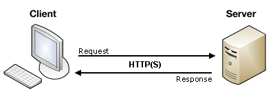

# MDN

[MDN](https://developer.mozilla.org/zh-CN/)

# 准备知识

### 浏览器工作原理

1. 浏览器组成
2. 浏览器渲染引擎工作原理
3. 通过浏览器访问网站全过程

### Web 开发本质

1. 请求: 客户端发起请求.
2. 处理: 服务器 处理请求.
3. 响应: 服务器将处理结果发送给客户端.

Web应用程序与桌面应用程序对比（计算器案例）

关于C/S（Client/Server） 和 B/S（Browser/Server）

# node.js 介绍

1. node.js 是什么？
2. node.js 有哪些特点？
3. node.js 官方网站
4. node.js 学习资源
5. 为什么要学习Node.js?
6. Node.js安装和配置
7. Node.js 开发 Web 应用程序 和 PHP、Java、ASP.Net等传统模式开发Web应用程序区别

# node.js 编程

1. node.js 编写控制台程序
2. node.js 进行文件读写
  - 同步 & 异步读取文件
3. node.js 创建 http 服务程序

# 解释异步是如何实现的？ eventloop

# npm 介绍

# node.js 实现新闻列表

