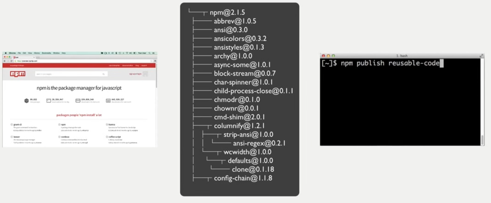
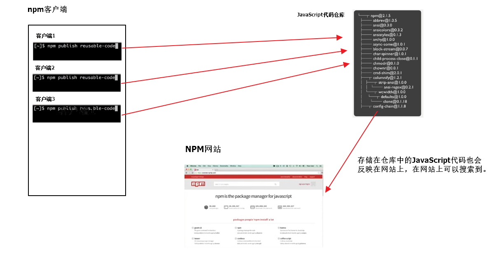

# NPM - Node Package Manager - Node 包管理器


## NPM 是什么？

- npm（全称Node Package Manager，即node包管理器）是Node.js默认的、以JavaScript编写的软件包管理系统。
- [npm 官方网站](https://www.npmjs.com/)
- [npm 官方文档](https://docs.npmjs.com/)


## 一般当我们说npm的时候可能指3件事

1. NPM 网站：https://www.npmjs.com/
2. NPM 包管理库，存储了大量的JavaScript代码库
3. NPM 客户端，我们所使用的npm命令行工具。使用JavaScript开发的基于node.js的命令行工具，本身也是Node的一个包。


## 参考图片






## NPM 官方解释：
- npm is the package manager for JavaScript and the world’s largest software registry.
  + npm 是一个JavaScript包管理器，并且是世界上最大的软件登记处

- discover packages of reusable code — and assemble them in powerful new ways.
  + 发现可重用代码，并集成代码包到项目中的全新的、强大方式


- npm makes it easy for JavaScript developers to share and reuse code, and it makes it easy to update the code that you're sharing.
  + npm 让JavaScript开发者共享和重用代码变的更容易，同时也让我们更容易地更新正在被共享的代码


## npm与 node.js
- npm是Node.js默认的软件包管理系统。安装完毕node后，会默认安装好npm
- npm本身也是基于Node.js开发的包（软件）


## 如何安装 NPM?
- npm会随着Node.js自动安装，安装完毕node.js后会自动安装npm
- 查看当前npm版本：`npm -v`
- 更新npm：`npm install npm@latest -g`


## NPM 使用

1. 在 https://www.npmjs.com/ 网站找到需要的包
2. 在项目的根目录下，执行`npm install 包名称`安装
3. 在node.js代码中通过 `require('包名');` 加载该模块
4. 注意：通过`npm install 包名`安装的包，会自动下载到当前目录下的`node_modules`目录下，如果该目录不存在，则创建，如果已存在则直接下载进去。
5. 在代码中通过 `require('包名');` 加载该模块

----- 上面说的这种方式叫做 本地安装。


## NPM 全局安装介绍

1. 什么是 npm 全局安装？
  - `npm install 包名 -g` npm 全局安装指的是把包安装成了一个命令行工具。

```javascript
  // 通过npm全局安装mime
  npm install mime -g

  //安装完毕后可以在命令行中直接使用
  mime a.txt 命令来查看对应的结果
```

2. npm 全局安装实际做了2件事：
  1. 下载包到一个指定的目录`C:\Users\username\AppData\Roaming\npm\node_modules`

  2. 创建一段命令行执行的代码。` C:\Users\username\AppData\Roaming\npm\mime -> C:\Users\steve xiaohu zhao\AppData\Roaming\npm\node_modules\mime\cli.js`


## NPM 安装建议
1. 全局安装只是为了可以当做命令行使用而已
 


## 五、npm常用命令介绍
1. install，安装包。`npm install 包名`
2. uninstall，卸载包。·npm uninstall 包名`
3. version，查看当前npm版本。`npm version` 或 `npm -v`

4. init，创建一个package.json文件。`npm init`
5. 注意：当使用 `npm init -y`  的时候，如果当前文件夹（目录）的名字比较怪（有大写、有中文等等）就会影响npm init -y 的一步生成操作，此时需要 npm init 根据向导来生成


## "模块"（Modules）和"包"（Packages）的区别

1. A **module** is any file or directory that can be loaded by Node.js' `require()`. 
- 模块可以是任何一个文件或目录（目录下可以有很多个文件），只要能被node.js通过require()即可。


2. A **package** is a file or directory that is described by a `package.json`. This can happen in a bunch of different ways!
- 包是一个文件或目录（目录下可以有多个文件）必须有一个package.json文件来描述，就可以是一个包。


node.js 错误调试：
1. 当开启服务后，在浏览器中输入地址，如果出现浏览问题，首先要先看 服务器控制台是否报错。如果报错，直接根据服务器报错进行排错。

2. 打开浏览器开发者工具中的 “网络” 部分，查看请求是否成功发出去了
- 看一下请求报文是不是和我们想的一样
- 响应状态码


